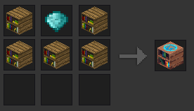
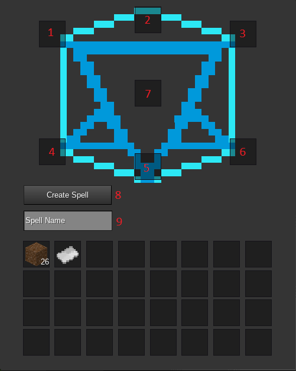
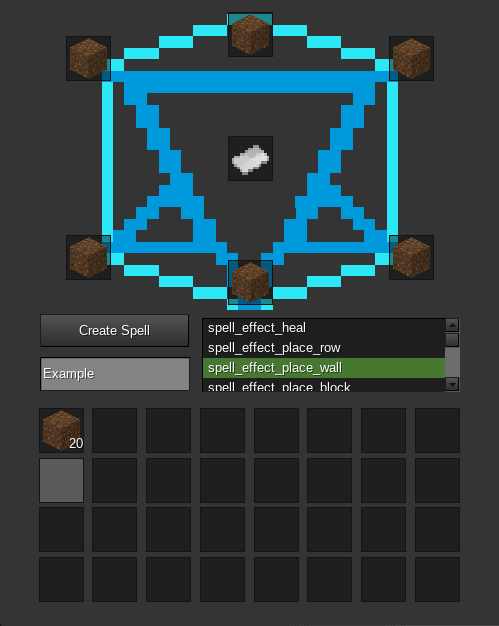
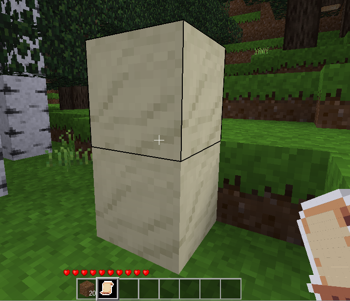
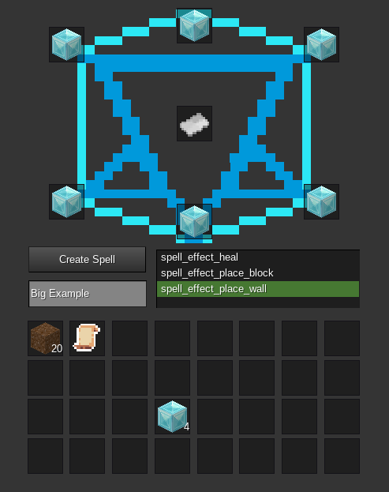

# SpellTest
A spell-crafting system for MineTest

## Description
This is a magic mod that allows the user to create their own spells using a new crafting mechanic which encourages curiosity and creativity.
Each spell consists of several different attributes that are controlled by the 6 spell ingredients. Most default items in Minetest are supported as spell ingredients and
you can even add your own with just a single line. Each ingredient has different attributes that are taken into consideration for the spell and once you've set all the ingredients you may chose
how you want the spell to behave. Do you want to heal? Summon a huge wall from the ground? Or maybe some utility by changing your gravity or manipulating the time? Those and several other options
are so far available for the spell behaviour with even more to come.

Important, the spell crafting feature is WIP! It's nowhere close to be balanced and bug free.

There are also a few hardcoded spells which can partially recreated with the dynamic spell system, those are
* "spell_dirt_pillar"
* "spell_stone_pillar"
* "spell_fountain"
* "spell_heal_weak"
* "spell_heal_medium"
* "spell_heal_strong"
* "spell_low_gravity"
* "spell_zero_gravity"
* "spell_night"
* "spell_day"
* "spell_water"
* "spell_flood"
* "spell_wall_stone"

There is also a WIP spellbook used for storing crafted spells and recreating them without needing the research table but it's not yet properly implemented.
The recipes in the spellbook are stored per player so you could use it on a multiplayer server and each player have their own spellbooks.

# Getting started
The first thing you have to do to create your own spells is crafting a researcher. The researcher is a crafting table for spells.
To get started creating and using spells you first have to create a researcher, this will be the crafting table for all your future spells.

## Researcher

The recipe is:

BDB

BBB

XXX

B -> Bookshelf

D -> Diamond

X -> None

Just place the researcher down and right-click it to open up its interface.

1 - 6 : Here you can put in your ingredients for your spell. The better the ingredient (better -> rare, shiny, special), the better the outcome might be. It's also important where you put your ingredient in, each
of the slots is affecting a different aspect of the spell.
Once you've filled all slots, a list will appear in which you have to define the spell behaviour.

7 : This slot needs to be filled with a sheet of paper.

8 : Once you've filled all the slots and selected a spell effect from the popup-list, you may create your spell. If you did everything correctly, the ingredients are consumed and the paper is transformed into your
new spell!

9 : You might want to give your spells different names, as they become hard to manage otherwise

## Spells

Now that you have crafted your first spell, you can try it out by left-clicking a nearby block and watch what happens.
Heres what happens with our dirt - wall spell:

Well that's rather disappointing. So how about if we use diamond-blocks only instead?

Now that's what I'm talking about! Free mese lamps \ o /

Pick different ingredients, mix them up, put them in different slots and watch what happens. It's all dynamic and the results can be unexpected but fun!

If you've created a spell that you like, make sure to renew it before you use all its charges. You can use the usual crafting interface to recharge your spells. Just place them there with coal, gold-ingots or diamonds to restore some spell uses.

# What's added

## Commands
The following Commands are added by this mod:
- /add_recipe <player> <item_created> <amount> <item_cost>
- /reset_recipes <player>

## New Items

The following items are added by this mod:
* "spellbook"
* "spell_dirt_pillar"
* "spell_stone_pillar"
* "spell_fountain"
* "spell_heal_weak"
* "spell_heal_medium"
* "spell_heal_strong"
* "spell_low_gravity"
* "spell_zero_gravity"
* "spell_night"
* "spell_day"
* "spell_water"
* "spell_flood"
* "spell_wall_stone"
* "spell_fireball"
* "spell_waterball"
* "spell_custom"
* "spell_random"
* "researcher"

# API Documentation 

## Creating a custom spell
- create a new itemstack from spelltest:spell_custom and do the basic stuff - count, description ...
- set the following meta datas for the itemstack:
	- STRING spell_description - Usually equals description, is used to change the name with uses left
	- INT	 spell_uses - Defines how often the spell may be used before it's destroyed
	- TABLE spell - Table with the wanted spell effect and parameters
		- STRING spell.spell_effect	- One of the given spell effect functions above. E.g "spell_effect_pillar", "spell_effect_place_row", "spell_effect_place_wall"
		- TABLE  spell.parameters - Stores all the parameters that are used for the given effect. All currently used parameters are: length, height, width, duration, value, block
- You're done.

# Change log

- 0.1 - Initial release
- 0.2 - Implemented parametised spells/randomly generated
- 0.3 - Implemented ingame spell crafting