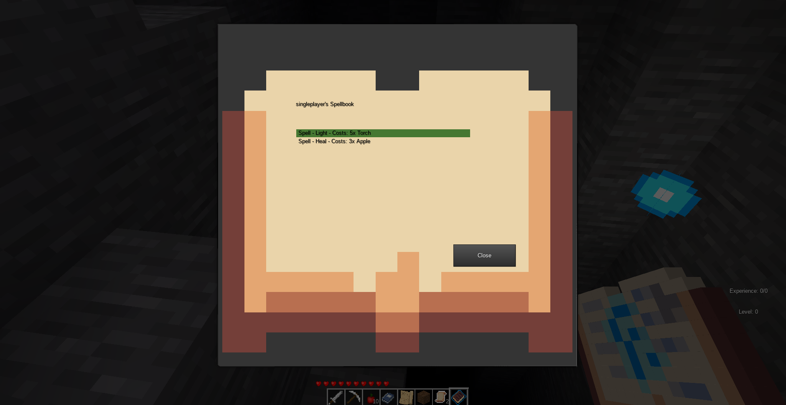

## SpellTest
A spell-crafting system for MineTest

This mod is based on Tukkek's idea on how to implement a rather dynamic spell system with flexible spell costs for his minerpg mod. SpellTest consists of two features, a spell book that can store creation of various spells or items with ingredients. The default two recipes are

* A Light-Spell which shoots out a projectile to cast light on the point it hits a surface, costing 5 torches.
* A Healing-Spell which heals the user by 10 HP costing 3 apples.

The recipes in the spell book are stored per player so you could use it on a multiplayer server and each player have their own spell books. The API to implement the spell book is at the very beginning of the spellbook.lua file.

The other feature are spells, they are implemented via different magic scrolls that are consumed to cast the spell. So far there are

* Heal
* Light
* Day
* Night

with more to come.

### Change log

- 0.1 - Initial release
